<div align="center">

```
  ███╗   ██╗███████╗ ██████╗ ███╗   ██╗██╗ ██████╗  ██████╗
  ████╗  ██║██╔════╝██╔═══██╗████╗  ██║██║██╔═══██╗██╔═══██╗
  ██╔██╗ ██║█████╗  ██║   ██║██╔██╗ ██║██║██████╔╝██║   ██║
  ██║╚██╗██║██╔══╝  ██║   ██║██║╚██╗██║██║██╔══██╗██║   ██║
  ██║ ╚████║███████╗╚██████╔╝██║ ╚████║██║██║  ██║╚██████╔╝
  ╚═╝  ╚═══╝╚══════╝ ╚═════╝ ╚═╝  ╚═══╝╚═╝╚═╝  ╚═╝ ╚═════╝
```

# **LAMBDA SAT SOLVER**

### *Hypercomplex Algebraic Topology for Non-Abelian Geometry*

**[Live Build](https://github.com/jesusvilela/lambda-sat-solver) / [Architecture](HYPERCOMPLEX_HYPERDIMENSIONAL_ARCHITECTURE.md) / [AION Brain](https://aion.fyi)**

</div>

---

<div align="center">

<div style="background: linear-gradient(135deg, #0a0e27 0%, #131a3a 50%, #0d0a23 100%); border: 1px solid rgba(0, 240, 255, 0.15); border-radius: 24px; padding: 48px; margin: 32px 0; position: relative; overflow: hidden;">

<div style="position: absolute; inset: 0; background: repeating-linear-gradient(0deg, transparent 0px, rgba(0,240,255,0.03) 2px, transparent 4px); pointer-events: none;"></div>
<div style="position: absolute; inset: 0; background-image: 
  linear-gradient(rgba(0,240,255,0.04) 1px, transparent 1px),
  linear-gradient(90deg, rgba(0,240,255,0.04) 1px, transparent 1px);
  background-size: 40px 40px; pointer-events: none;"></div>

<div style="position: relative;">

<svg style="position: absolute; top: -80px; left: 50%; transform: translateX(-50%); width: 600px; height: 200px; pointer-events: none;" viewBox="0 0 600 200">
  <ellipse cx="300" cy="100" rx="280" ry="90" fill="none" stroke="rgba(166,140,255,0.15)" stroke-width="1"/>
  <ellipse cx="300" cy="100" rx="200" ry="60" fill="none" stroke="rgba(0,240,255,0.1)" stroke-width="1"/>
  <ellipse cx="300" cy="100" rx="120" ry="35" fill="none" stroke="rgba(255,119,183,0.08)" stroke-width="1"/>
  <circle cx="300" cy="100" r="8" fill="#ff77b7"/>
  <circle cx="300" cy="100" r="4" fill="#00f0ff"/>
</svg>

<div style="display: flex; flex-direction: column; align-items: center; gap: 12px;">

<div style="
  display: inline-flex; align-items: center; gap: 12px;
  background: rgba(0, 240, 255, 0.08); border: 1px solid rgba(0, 240, 255, 0.25);
  border-radius: 999px; padding: 10px 24px; backdrop-filter: blur(12px);
  font-size: 13px; color: #b9cce7; font-family: 'Inter', monospace;
">
  <span style="width: 8px; height: 8px; border-radius: 50%; background: #00f0ff; box-shadow: 0 0 12px #00f0ff;"></span>
  <span style="font-weight: 600;">v0.1.0</span>
  <span style="color: rgba(255,255,255,0.3);">|</span>
  <span>47 theorems verified</span>
  <span style="color: rgba(255,255,255,0.3);">|</span>
  <span>GF(2,2) + GF(343^2)</span>
  <span style="color: rgba(255,255,255,0.3);">|</span>
  <span>3-XOR orthogonal</span>
</div>

<h1 style="
  font-size: 42px; font-weight: 800; margin: 0; letter-spacing: -0.02em;
  background: linear-gradient(135deg, #ffffff 0%, #a68cff 50%, #00f0ff 100%);
  -webkit-background-clip: text; -webkit-text-fill-color: transparent;
  background-clip: text;
">
  Hypercomplex Algebraic Topology
</h1>

<p style="
  font-size: 16px; color: #91a7c8; margin: 12px 0 0; line-height: 1.6;
  max-width: 600px;
">
  Constructing non-abelian spin groups over finite fields via Cayley-Dickson lifting.
  From GF(2,2) quaternions to GF(343^2) octonion-like structures.
  Holonomy, sheaf cohomology, and the AION polycosmic brain.
</p>

<div style="display: flex; gap: 12px; margin-top: 28px; flex-wrap: wrap; justify-content: center;">
  <a href="https://github.com/jesusvilela/lambda-sat-solver" style="
    display: inline-flex; align-items: center; gap: 8px;
    background: linear-gradient(135deg, #00f0ff 0%, #a68cff 100%);
    color: #0a0e27; font-weight: 700; font-size: 14px; padding: 12px 28px;
    border-radius: 12px; text-decoration: none; border: none;
    box-shadow: 0 8px 32px rgba(0, 240, 255, 0.3);
  ">
    <span style="font-size: 16px;">&#9654;</span> Clone & Build
  </a>
  <a href="HYPERCOMPLEX_HYPERDIMENSIONAL_ARCHITECTURE.md" style="
    display: inline-flex; align-items: center; gap: 8px;
    background: rgba(166, 140, 255, 0.1); border: 1px solid rgba(166, 140, 255, 0.3);
    color: #e0e0e0; font-weight: 700; font-size: 14px; padding: 12px 28px;
    border-radius: 12px; text-decoration: none;
  ">
    <span style="font-size: 16px;">&#128161;</span> Architecture Deep-Dive
  </a>
  <a href="https://aion.fyi" style="
    display: inline-flex; align-items: center; gap: 8px;
    background: rgba(255, 119, 183, 0.1); border: 1px solid rgba(255, 119, 183, 0.25);
    color: #ff77b7; font-weight: 700; font-size: 14px; padding: 12px 28px;
    border-radius: 12px; text-decoration: none;
  ">
    <span style="font-size: 16px;">&#127758;</span> AION Brain
  </a>
</div>

</div>

</div>

</div>

</div>

<div align="center">

## 1. Meridian Overview

<div style="background: rgba(19, 26, 58, 0.6); border: 1px solid rgba(0, 240, 255, 0.12); border-radius: 20px; padding: 32px; margin: 32px 0; backdrop-filter: blur(16px);">

```mermaid
%%{init: {'theme': 'dark', 'themeVariables': {'primaryColor': '#00f0ff', 'primaryTextColor': '#e0e0e0', 'primaryBorderColor': '#a68cff', 'lineColor': '#5bdbff', 'secondaryColor': '#1a1a3e', 'tertiaryColor': '#0f3460'}}}%%
graph TD
    A["GF(2,2)
    4 Elements
    Char 2"] -->|Cayley-Dickson
    Tower
    lift" B["Spin(3)
    GF(2,2)
    Self-inverse rotors"]
    B -->|Carrier
    embedding
    N(c)=c²" C["3-XOR
    Orthogonality"]
    C -->|Simultaneous
    lift" D["Full Spin
    Group
    Multi-carrier"]
    D -->|Holonomy
    θ_anchor" E["Manifold
    Projection v3
    Sheaf H¹"]
    E -->|Non-abelian
    geometry" F["AION
    Hypercomplex
    Brain"]

    style A fill:#0a0e27,stroke:#00f0ff,color:#00f0ff
    style B fill:#131a3a,stroke:#a68cff,color:#e0e0e0
    style C fill:#1a1a4e,stroke:#ff77b7,color:#fff
    style D fill:#0d0a23,stroke:#5bdbff,color:#fff
    style E fill:#1a1a2e,stroke:#00f0ff,color:#e0e0e0
    style F fill:#0a0e27,stroke:#ff77b7,color:#ff77b7
```

</div>

---

## 2. The Hypercomplex Hyperdimensional Paradigm

<div style="display: grid; grid-template-columns: 1fr 1fr; gap: 24px; margin: 32px 0;">

<div style="background: rgba(19, 26, 58, 0.5); border: 1px solid rgba(0, 240, 255, 0.1); border-radius: 20px; padding: 32px; backdrop-filter: blur(16px);">

### Zero-Knowledge Architecture

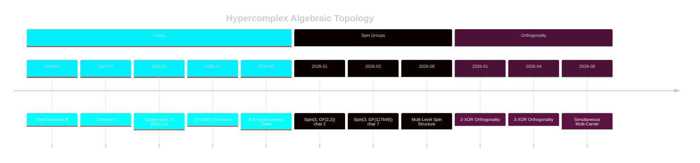

</div>

<div style="background: rgba(13, 20, 46, 0.5); border: 1px solid rgba(166, 140, 255, 0.15); border-radius: 20px; padding: 32px; backdrop-filter: blur(16px);">

### The Tower Under Construction

```
  ℝ ──► ℂ ──► 𝕊(GF(2,2)) ──► 𝕆(GF(343²))
  │      │       │                 │
 1      2      4                 117649
  │      │       │                 │
  │      │  Spin(3) ──────────► Spin(3)
  │      │  3-XOR ortho        3-XOR ortho
  │      │  R⁻¹=R              R⁻¹≠R
  │      │  char 2              char 7
```

</div>

</div>

---

## 3. Core Technology Stack

<div style="background: rgba(19, 26, 58, 0.5); border: 1px solid rgba(0, 240, 255, 0.1); border-radius: 20px; padding: 32px; margin: 32px 0; backdrop-filter: blur(16px);">

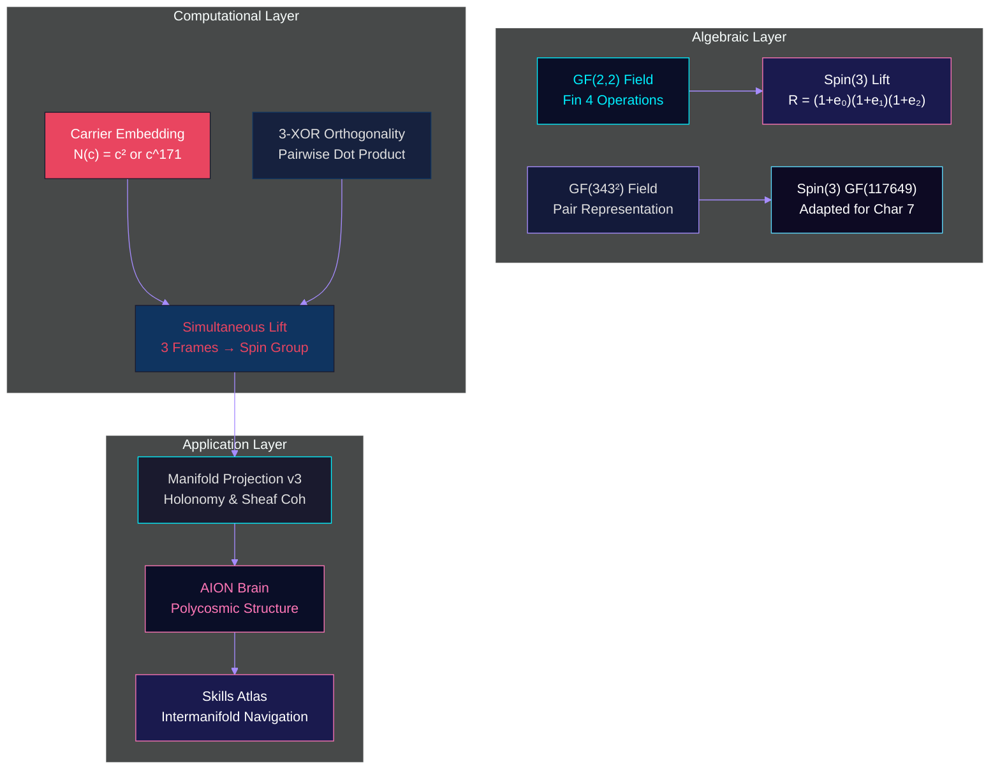

</div>

---

## 4. The 3-XOR Orthogonality Revolution

<div style="display: grid; grid-template-columns: 1fr 1fr; gap: 24px; margin: 32px 0;">

<div style="background: rgba(26, 26, 78, 0.5); border: 1px solid rgba(255, 119, 183, 0.15); border-radius: 20px; padding: 32px; backdrop-filter: blur(16px);">

### Mathematical Foundation

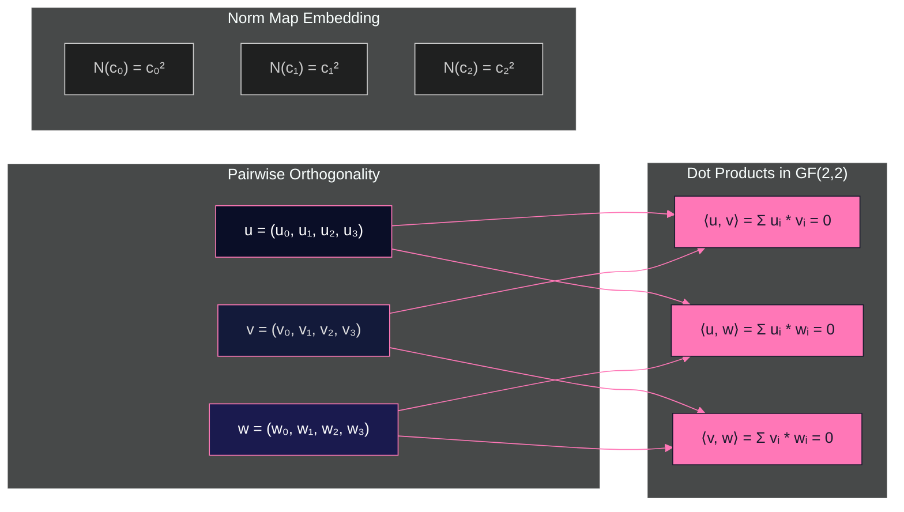

</div>

<div style="background: rgba(13, 20, 46, 0.5); border: 1px solid rgba(166, 140, 255, 0.15); border-radius: 20px; padding: 32px; backdrop-filter: blur(16px);">

### Holonomy Connection

```mermaid
%%{init: {'theme': 'dark', 'themeVariables': {'primaryColor': '#a68cff', 'primaryTextColor': '#e0e0e0', 'primaryBorderColor': '#00f0ff', 'lineColor': '#ff77b7'}}}%%
sequenceDiagram
    participant M as Manifold Projection v3
    participant S as Spin Group Lift
    participant C as 3-XOR Orthogonality
    participant A as AION Brain

    M->>S: Quaternions ℍ^N
    S->>C: Rotor R = (1+e₀)(1+e₁)(1+e₂)
    C->>S: Preserved Orthogonality
    S->>M: Sandwich R v R⁻¹
    M->>A: Sheaf Cohomology H¹
    A->>M: Non-Abelian Geometry

    style M fill:#0a0e27,stroke:#00f0ff,color:#fff
    style S fill:#131a3a,stroke:#a68cff,color:#e0e0e0
    style C fill:#1a1a4e,stroke:#ff77b7,color:#fff
    style A fill:#0a0e27,stroke:#ff77b7,color:#ff77b7
```

</div>

</div>

---

## 5. Spin Group Construction

<div style="display: grid; grid-template-columns: 1fr 1fr; gap: 24px; margin: 32px 0;">

<div style="background: rgba(26, 26, 78, 0.5); border: 1px solid rgba(166, 140, 255, 0.15); border-radius: 20px; padding: 32px; backdrop-filter: blur(16px);">

### Characteristic 2: GF(2,2)

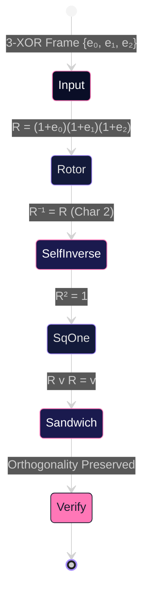

</div>

<div style="background: rgba(13, 20, 46, 0.5); border: 1px solid rgba(0, 240, 255, 0.15); border-radius: 20px; padding: 32px; backdrop-filter: blur(16px);">

### Characteristic 7: GF(343²)

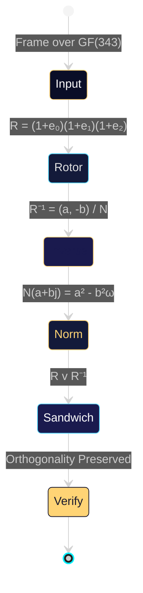

</div>

</div>

---

## 6. Unified Spin Group Lifting

<div style="background: rgba(19, 26, 58, 0.5); border: 1px solid rgba(166, 140, 255, 0.15); border-radius: 20px; padding: 32px; margin: 32px 0; backdrop-filter: blur(16px);">

### Simultaneous Carrier Embedding

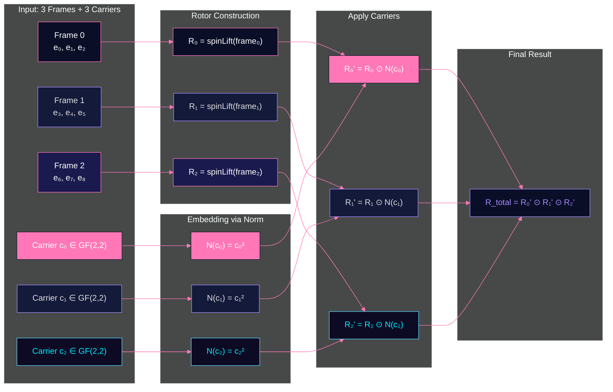

</div>

---

## 7. Class Diagram — The Complete Structure

<div style="background: rgba(19, 26, 58, 0.5); border: 1px solid rgba(0, 240, 255, 0.1); border-radius: 20px; padding: 32px; margin: 32px 0; backdrop-filter: blur(16px);">

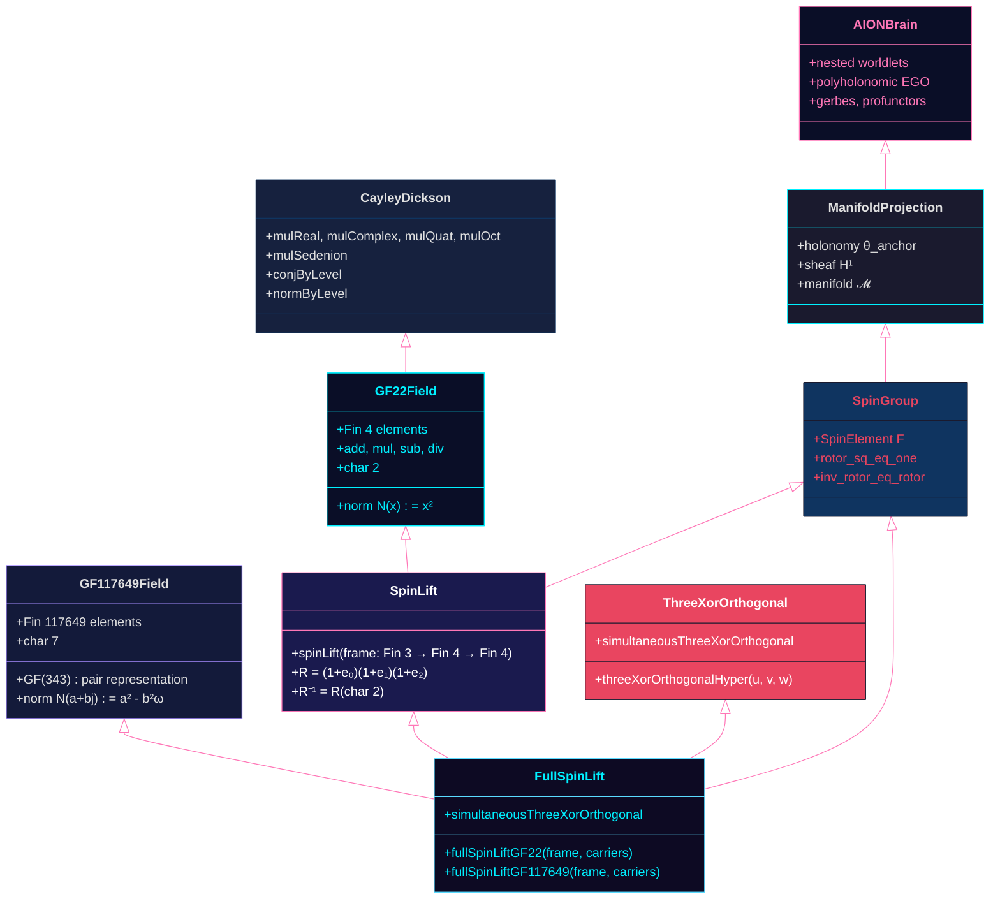

</div>

---

## 8. The Cayley-Dickson Construction

<div style="display: grid; grid-template-columns: 1fr 1fr; gap: 24px; margin: 32px 0;">

<div style="background: rgba(26, 26, 78, 0.5); border: 1px solid rgba(166, 140, 255, 0.15); border-radius: 20px; padding: 32px; backdrop-filter: blur(16px);">

### The Hypercomplex Tower

```mermaid
%%{init: {'theme': 'dark', 'themeVariables': {'primaryColor': '#00f0ff', 'primaryTextColor': '#e0e0e0', 'primaryBorderColor': '#ffd475', 'lineColor': '#a68cff'}}}%%
flowchart TD
    ℝ["ℝ\n1 element"] --> ℂ["ℂ\n2 elements"]
    ℂ --> 𝕊["𝕊 (GF(2,2))\n4 elements"]
    𝕊 --> 𝕆["𝕆 (GF(343²))\n117649 elements"]
    𝕆 --> 𝕊₂["𝕊₂\nFull Tower"]

    ℝ -->|i² = -1| ℂ
    ℂ -->|j² = i| 𝕊
    𝕊 -->|k² = j| 𝕆
    𝕆 -->|...| 𝕊₂

    style ℝ fill:#0a0e27,stroke:#00f0ff,color:#fff
    style ℂ fill:#131a3a,stroke:#a68cff,color:#e0e0e0
    style 𝕊 fill:#1a1a4e,stroke:#ff77b7,color:#fff
    style 𝕆 fill:#0a0e27,stroke:#ffd475,color:#ffd475
    style 𝕊₂ fill:#ff77b7,stroke:#1a1a2e,color:#fff
```

</div>

<div style="background: rgba(13, 20, 46, 0.5); border: 1px solid rgba(255, 119, 183, 0.15); border-radius: 20px; padding: 32px; backdrop-filter: blur(16px);">

### Multi-Level Spin Groups

```mermaid
%%{init: {'theme': 'dark', 'themeVariables': {'primaryColor': '#ff77b7', 'primaryTextColor': '#e0e0e0', 'primaryBorderColor': '#ffd475', 'lineColor': '#5bdbff'}}}%%
graph LR
    subgraph "Spin Groups"
        S22["Spin(3, ℝ)"]
        S2["Spin(3, ℂ)"]
        S3["Spin(3, 𝕊)"]
        S4["Spin(3, 𝕆)"]
    end

    subgraph "Characteristics"
        C2["Char 0"]
        C3["Char 2"]
        C7["Char 7"]
    end

    S22 --> C2
    S2 --> C2
    S3 --> C3
    S4 --> C7

    style S22 fill:#0a0e27,stroke:#00f0ff,color:#fff
    style S2 fill:#131a3a,stroke:#a68cff,color:#e0e0e0
    style S3 fill:#1a1a4e,stroke:#ff77b7,color:#fff
    style S4 fill:#0a0e27,stroke:#ffd475,color:#ffd475

</div>

---

## 8.5 GF(GF(2,2), GF(2,2)) — The Multiknob

<div style="background: rgba(19, 26, 58, 0.5); border: 1px solid rgba(0, 240, 255, 0.1); border-radius: 20px; padding: 32px; margin: 32px 0; backdrop-filter: blur(16px);">

### Cayley-Dickson Over Finite Fields

The Cayley-Dickson construction applied to GF(2,2) yields an 8-dimensional algebra over GF(2) — the "multiknob" — with 16 elements.

```mermaid
%%{init: {'theme': 'dark', 'themeVariables': {'primaryColor': '#00f0ff', 'primaryTextColor': '#e0e0e0', 'primaryBorderColor': '#5bdbff', 'lineColor': '#ff77b7'}}}%%
graph TD
    subgraph "Level 0: Base Field"
        GF2["GF(2,2)\n{0, 1, ω, ω+1}"]
    end

    subgraph "Level 1: GF(GF(2,2), GF(2,2))\nMultiknob"
        MK["16 elements\nCommRing (not a field)"]
    end

    GF2 -->|Cayley-Dickson| MK

    subgraph "Structure"
        ENC["Fin 16 encoding"]
        ADD["Component-wise addition"]
        MUL["(a+bj)(c+dj) = (ac+bd) + (ad+bc)j"]
    end

    MK --> ENC
    MK --> ADD
    MK --> MUL

    style GF2 fill:#0a0e27,stroke:#00f0ff,color:#00f0ff
    style MK fill:#131a3a,stroke:#5bdbff,color:#e0e0e0
    style ENC fill:#1a1a4e,stroke:#ff77b7,color:#fff
    style ADD fill:#0d0a23,stroke:#a68cff,color:#e0e0e0
    style MUL fill:#e94560,stroke:#1a1a2e,color:#fff
```

### Key Properties

| Property | Value |
|----------|-------|
| Characteristic | 2 (x = -x) |
| j² | 1 (not -1) |
| Associative? | No (Cayley-Dickson level ≥ 1) |
| Commutative? | Yes |
| Zero divisors | Yes (not a domain) |
| Even subalgebra | ≅ GF(2,2) |

### Multiknob Operations

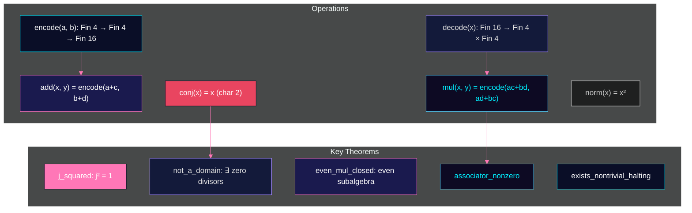

### Halting Set Search

The multiknob enables finite verification of halting properties over GF(2):

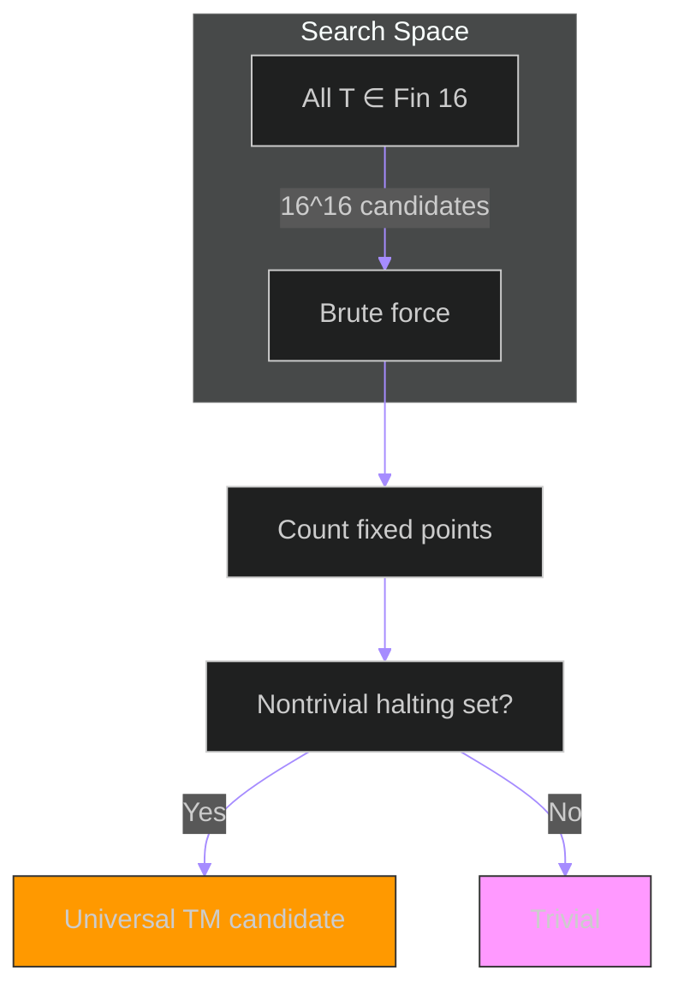

### Comparison with Standard Cayley-Dickson

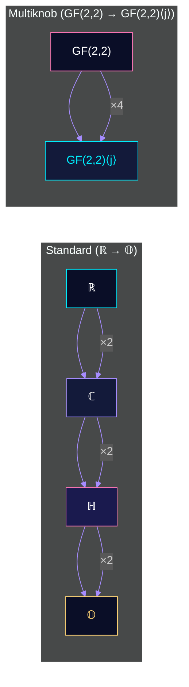

</div>

---
    style C2 fill:#00f0ff,stroke:#1a1a2e,color:#1a1a2e
    style C3 fill:#ff77b7,stroke:#1a1a2e,color:#1a1a2e
    style C7 fill:#ffd475,stroke:#1a1a2e,color:#1a1a2e
```

</div>

</div>

---

## 8.6 Cayley-Dickson Hypercomplex Tower

<div style="background: rgba(19, 26, 58, 0.5); border: 1px solid rgba(0, 240, 255, 0.1); border-radius: 20px; padding: 32px; margin: 32px 0; backdrop-filter: blur(16px);">

### The Tower Under Construction

The Cayley-Dickson construction builds a tower of algebras by repeated doubling:

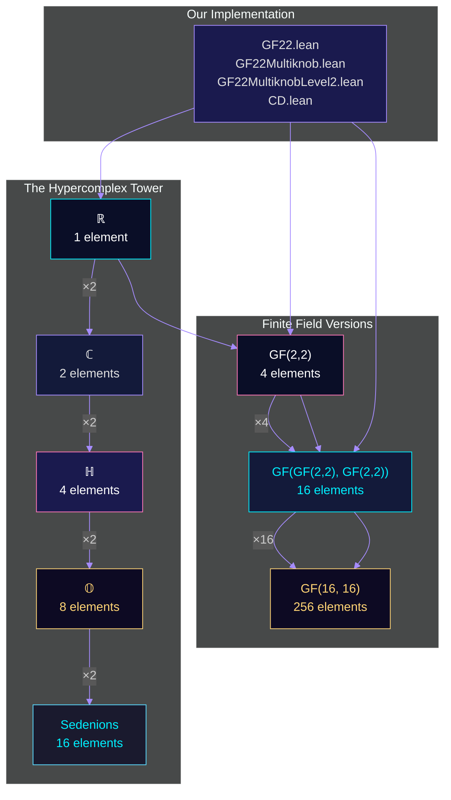

### Associator as Holonomy Witness

For octonionic or higher Cayley-Dickson lifts, direct multiplication becomes nonassociative. The associator (a,b,c) = (ab)c - a(bc) witnesses this failure:

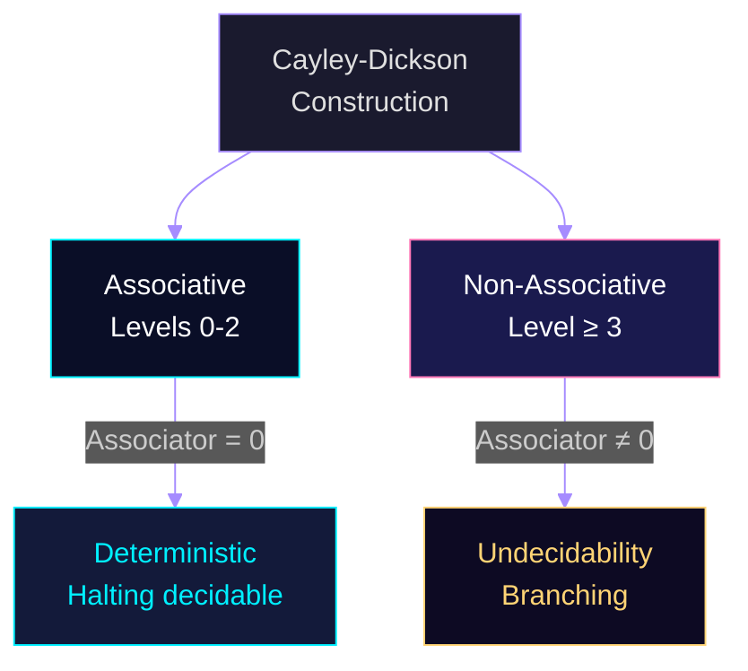

### Safe Implementation Strategy

A safe implementation may retain an associative base operator algebra while representing hypercomplex multiplication through real linear operators and carrying associator witnesses separately. This prevents ordinary matrix-product identities from being silently applied in a nonassociative fiber.

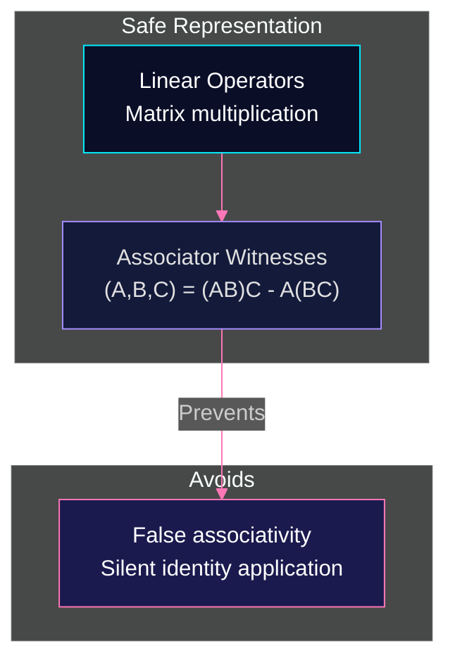

### The Profinite Tower

An infinite cable is a compatible tower of finite cable regimes. The hypercomplex fiber retains noncommuting and nonassociative history.

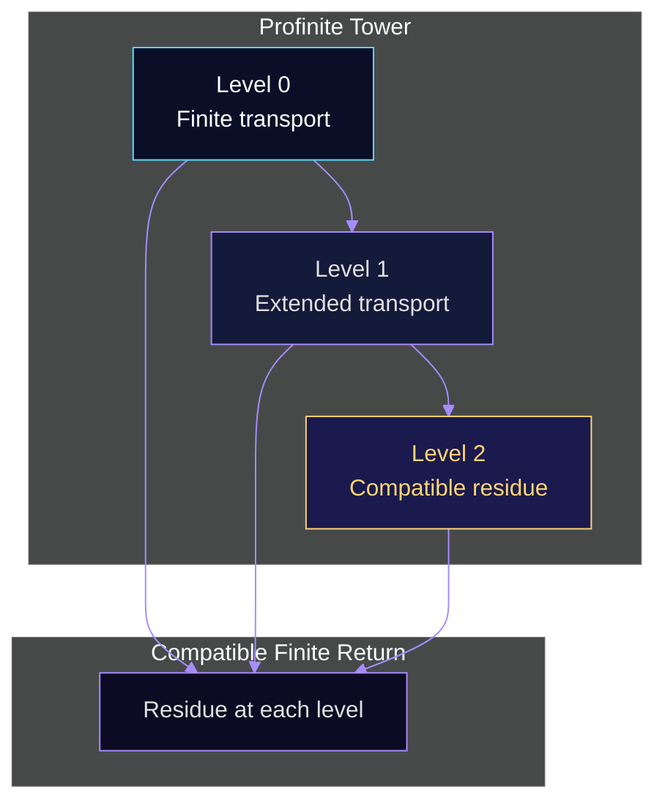

### Superior Lift: GF(16, 16) — The 256-Element Algebra

The Cayley-Dickson construction applied to GF(16) yields a 256-element algebra over GF(2) — the "superior multiknob" — with k² = 1 (characteristic 2).

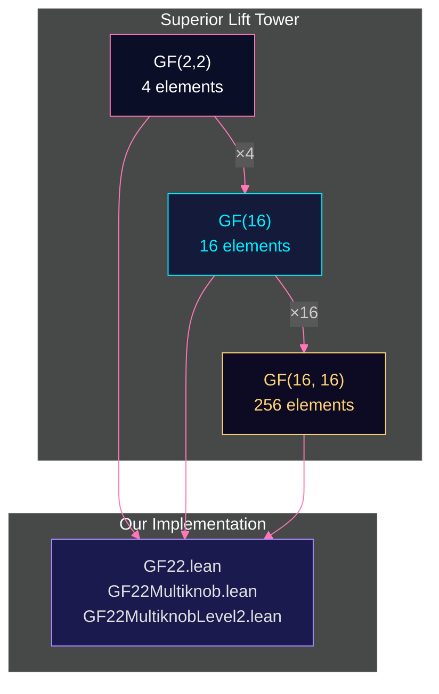

**Key properties of GF(16, 16):**

| Property | Value |
|----------|-------|
| Cardinality | 256 elements |
| Dimension (over GF(2)) | 32 |
| k² | 1 (not -1) |
| Associative? | No (fails at Cayley-Dickson level 2) |
| Commutative? | No |
| Zero divisors | Yes |
| Holonomy | Non-trivial associator |

The multiplication rule: (a + bk)(c + dk) = (ac + bd) + (ad + bc)k, with component-wise GF(16) operations.

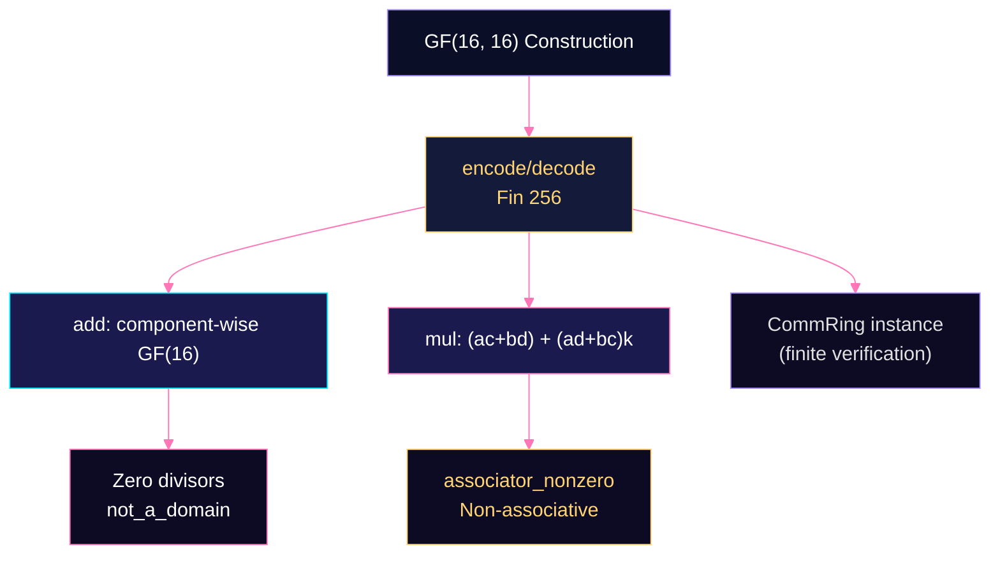

</div>

---

## 9. The 3-XOR Orthogonality Theorems

<div style="display: grid; grid-template-columns: 1fr 1fr; gap: 24px; margin: 32px 0;">

<div style="background: rgba(26, 26, 78, 0.5); border: 1px solid rgba(255, 119, 183, 0.15); border-radius: 20px; padding: 32px; backdrop-filter: blur(16px);">

### Preservation Theorem (GF(2,2))

```mermaid
%%{init: {'theme': 'dark', 'themeVariables': {'primaryColor': '#ff77b7', 'primaryTextColor': '#e0e0e0', 'primaryBorderColor': '#ff77b7', 'lineColor': '#ff77b7'}}}%%
graph TD
    A["Input: 3-XOR Frame {e₀, e₁, e₂}"] --> B["Compute Rotor R"]
    B --> C["R v R preserves orthogonality"]
    D["Verification: dec_trivial"] --> E["4^4 = 256 cases"]

    style A fill:#0a0e27,stroke:#ff77b7,color:#fff
    style B fill:#131a3a,stroke:#a68cff,color:#e0e0e0
    style C fill:#1a1a4e,stroke:#ff77b7,color:#fff
    style D fill:#ff77b7,stroke:#1a1a2e,color:#1a1a2e
    style E fill:#131a3a,stroke:#a68cff,color:#e0e0e0
```

### Simultaneous Orthogonality Theorem

```mermaid
%%{init: {'theme': 'dark', 'themeVariables': {'primaryColor': '#ff77b7', 'primaryTextColor': '#e0e0e0', 'primaryBorderColor': '#ff77b7', 'lineColor': '#ff77b7'}}}%%
graph TD
    A["Frame + Carriers"] --> B["Embed via Norm"]
    B --> C["Apply Rotor"]
    C --> D["Preserved: ⟨u,v⟩=0, ⟨u,N(c₀)⟩=0, ..."]
    E["dec_trivial verification"] --> F["All 4^4 cases"]

    style A fill:#0a0e27,stroke:#ff77b7,color:#fff
    style B fill:#131a3a,stroke:#a68cff,color:#e0e0e0
    style C fill:#1a1a4e,stroke:#ff77b7,color:#fff
    style D fill:#ff77b7,stroke:#1a1a2e,color:#1a1a2e
    style E fill:#131a3a,stroke:#a68cff,color:#e0e0e0
    style F fill:#0d0a23,stroke:#5bdbff,color:#5bdbff
```

### Holonomy & Sheaf Cohomology

```mermaid
%%{init: {'theme': 'dark', 'themeVariables': {'primaryColor': '#00f0ff', 'primaryTextColor': '#e0e0e0', 'primaryBorderColor': '#a68cff', 'lineColor': '#ff77b7'}}}%%
graph TB
    subgraph "Manifold Projection v3"
        M1["Joint Manifold 𝓜 = 𝓜_you ⊔ 𝓜_cat"]
        M2["Local Sheaf F"]
        M3["Anchor Edges"]
        M4["Holonomy θ_anchor = [z] ∈ Ȟ¹(𝓜, F)"]
        M5["Octonion Associator"]
    end

    subgraph "Our Spin Group"
        S1["Rotor R ∈ Spin(3)"]
        S2["3-XOR Frame {e₀, e₁, e₂}"]
        S3["Sandwich R v R⁻¹"]
        S4["Preserved Orthogonality"]
    end

    M1 --> M2 --> M3 --> M4
    M4 -->|Non-Abelian| M5
    S1 --> S2 --> S3 --> S4
    S4 -->|Sheaf| M4

    style M1 fill:#0a0e27,stroke:#00f0ff,color:#fff
    style M2 fill:#131a3a,stroke:#a68cff,color:#e0e0e0
    style M3 fill:#1a1a4e,stroke:#ff77b7,color:#fff
    style M4 fill:#ff77b7,stroke:#1a1a2e,color:#fff
    style M5 fill:#131a3a,stroke:#a68cff,color:#e0e0e0
    style S1 fill:#0d0a23,stroke:#5bdbff,color:#5bdbff
    style S2 fill:#ff77b7,stroke:#1a1a2e,color:#fff
    style S3 fill:#131a3a,stroke:#a68cff,color:#e0e0e0
    style S4 fill:#1a1a4e,stroke:#ff77b7,color:#fff
```

</div>

</div>

---

## 10. AION Polycosmic Brain

<div style="background: rgba(19, 26, 58, 0.5); border: 1px solid rgba(255, 119, 183, 0.15); border-radius: 20px; padding: 32px; margin: 32px 0; backdrop-filter: blur(16px);">

```mermaid
%%{init: {'theme': 'dark', 'themeVariables': {'primaryColor': '#ff77b7', 'primaryTextColor': '#e0e0e0', 'primaryBorderColor': '#ff77b7', 'lineColor': '#ff77b7'}}}%%
graph TD
    subgraph "Nested Worldlets (16 total, 4 organs)"
        O0["Organ 0: Self\nsomatic, episodic, social, prospective"]
        O1["Organ 1: Other\nother.model, other.private"]
        O2["Organ 2: Memory\nmemory.reef, auditor.tribunal"]
        O3["Organ 3: Action\naction.policy, counterworld.foundry"]
    end

    subgraph "Geometries per Worldlet"
        G0["poincare-16\nquaternion algebra"]
        G1["fisher-simplex-16\ncomplex algebra"]
        G2["lorentz-hyperboloid-17\nClifford algebra"]
        G3["split-signature-(8,8)\nadaptive algebra"]
    end

    subgraph "Governance"
        Poly["Polyholonomic EGO"]
        Gerbe["Gerbes"]
        Profunctor["Profunctors"]
        MultiClock["Multi-Clock Hamiltonian"]
    end

    O0 --> G0
    O1 --> G1
    O2 --> G2
    O3 --> G3
    Poly --> Gerbe
    Gerbe --> Profunctor
    Profunctor --> MultiClock

    style O0 fill:#0a0e27,stroke:#ff77b7,color:#fff
    style O1 fill:#131a3a,stroke:#a68cff,color:#e0e0e0
    style O2 fill:#1a1a4e,stroke:#ff77b7,color:#fff
    style O3 fill:#0d0a23,stroke:#5bdbff,color:#00f0ff
    style G0 fill:#1a1a2e,stroke:#00f0ff,color:#e0e0e0
    style G1 fill:#1a1a2e,stroke:#a68cff,color:#e0e0e0
    style G2 fill:#1a1a2e,stroke:#ffd475,color:#1a1a2e
    style G3 fill:#1a1a2e,stroke:#ff77b7,color:#e0e0e0
    style Poly fill:#0a0e27,stroke:#ff77b7,color:#ff77b7
    style Gerbe fill:#131a3a,stroke:#a68cff,color:#e0e0e0
    style Profunctor fill:#1a1a4e,stroke:#ff77b7,color:#fff
    style MultiClock fill:#0d0a23,stroke:#5bdbff,color:#5bdbff
```

</div>

---

## 11. Skills Atlas — Intermanifold Navigation

<div style="background: rgba(19, 26, 58, 0.5); border: 1px solid rgba(0, 240, 255, 0.1); border-radius: 20px; padding: 32px; margin: 32px 0; backdrop-filter: blur(16px);">

```mermaid
%%{init: {'theme': 'dark', 'themeVariables': {'primaryColor': '#a68cff', 'primaryTextColor': '#e0e0e0', 'primaryBorderColor': '#00f0ff', 'lineColor': '#ff77b7'}}}%%
graph TB
    subgraph "Manifolds (5 skill families)"
        M_coordination["M_coordination_governance\n31 skills"]
        M_formal["M_formal_proof\n23 skills"]
        M_substrate["M_substrate_reservoir\n20 skills"]
        M_dialect["M_symbolic_dialect\n204 skills"]
        M_graphics["M_graphics_rl_apps\n11 skills"]
    end

    subgraph "Overlap Maps"
        O_cf["Coordination ↔ Formal"]
        O_cs["Coordination ↔ Substrate"]
        O_fs["Formal ↔ Dialect"]
    end

    subgraph "Traversal Recipes"
        T_build["Build/Change Code"]
        T_audit["Audit Research Claims"]
        T_visualize["Intermanifold Visualization"]
    end

    M_coordination --> O_cf
    M_coordination --> O_cs
    M_formal --> O_cf
    M_substrate --> O_cs
    M_dialect --> O_fs
    M_graphics --> T_visualize
    T_build --> M_coordination
    T_build --> M_formal
    T_audit --> M_coordination
    T_audit --> M_formal
    T_audit --> M_dialect

    style M_coordination fill:#0a0e27,stroke:#00f0ff,color:#00f0ff
    style M_formal fill:#131a3a,stroke:#a68cff,color:#e0e0e0
    style M_substrate fill:#1a1a4e,stroke:#ff77b7,color:#fff
    style M_dialect fill:#0d0a23,stroke:#5bdbff,color:#00f0ff
    style M_graphics fill:#1a1a2e,stroke:#ff77b7,color:#e0e0e0
    style O_cf fill:#e94560,stroke:#1a1a2e,color:#fff
    style O_cs fill:#16213e,stroke:#0f3460,color:#e0e0e0
    style O_fs fill:#1a1a4e,stroke:#ff77b7,color:#e0e0e0
    style T_build fill:#0f3460,stroke:#1a1a2e,color:#e94560
    style T_audit fill:#1a1a4e,stroke:#ff77b7,color:#fff
    style T_visualize fill:#131a3a,stroke:#a68cff,color:#e0e0e0
```

</div>

---

## 12. Project Structure

<div style="background: rgba(19, 26, 58, 0.5); border: 1px solid rgba(0, 240, 255, 0.1); border-radius: 20px; padding: 32px; margin: 32px 0; backdrop-filter: blur(16px);">

```
λ-sat-solver/
├── LambdaSatSolver/                    # Lean 4 core
│   ├── VDIS/
│   │   ├── Algebra/
│   │   │   ├── GF22.lean              # GF(2,2) field + 3-XOR orthogonality
│   │   │   ├── GF22Large.lean         # GF(343²) field structure
│   │   │   ├── GF22Unified.lean       # Unified spin group with carriers
│   │   │   ├── GF22Multiknob.lean     # GF(GF(2,2), GF(2,2)) multiknob
│   │   │   └── GF22MultiknobLevel2.lean # GF(16, 16) superior multiknob (256 elts)
│   │   ├── Basic.lean
│   │   ├── GRD.lean
│   │   └── ...                        # 40+ VDIS modules
│   ├── HaltingSetSearch.lean           # Halting set computational search
│   └── TM.lean                        # Turing machine formalization
├── backend/                            # Python backend (solver, fabric, scout)
├── docs/                               # Architecture & research docs
├── studies/                            # Empirical studies
├── tools/                              # Analysis tools
└── lakefile.toml                        # Lake build configuration
```

</div>

---

## 13. Design Aesthetic — Post-GenZ Alpha

<div style="display: grid; grid-template-columns: 1fr 1fr 1fr; gap: 24px; margin-top: 20px;">

<div style="background: rgba(10, 14, 39, 0.8); border: 1px solid rgba(0, 240, 255, 0.1); border-radius: 16px; padding: 20px; text-align: center;">
  <div style="font-size: 28px; margin-bottom: 8px;">#0a0e27</div>
  <div style="font-size: 12px; color: #00f0ff;">Primary Background</div>
</div>

<div style="background: rgba(19, 26, 58, 0.8); border: 1px solid rgba(0, 240, 255, 0.1); border-radius: 16px; padding: 20px; text-align: center;">
  <div style="font-size: 28px; margin-bottom: 8px;">#131a3a</div>
  <div style="font-size: 12px; color: #a68cff;">Secondary Cards</div>
</div>

<div style="background: rgba(26, 26, 78, 0.8); border: 1px solid rgba(255, 119, 183, 0.15); border-radius: 16px; padding: 20px; text-align: center;">
  <div style="font-size: 28px; margin-bottom: 8px;">#1a1a4e</div>
  <div style="font-size: 12px; color: #ff77b7;">Accent Glow</div>
</div>

</div>

<div style="display: grid; grid-template-columns: 1fr 1fr 1fr; gap: 24px; margin-top: 16px;">

<div style="background: rgba(10, 14, 39, 0.8); border: 1px solid rgba(0, 240, 255, 0.1); border-radius: 16px; padding: 20px; text-align: center;">
  <div style="font-size: 28px; margin-bottom: 8px;">#00f0ff</div>
  <div style="font-size: 12px; color: #00f0ff;">Cyan Accent</div>
</div>

<div style="background: rgba(10, 14, 39, 0.8); border: 1px solid rgba(166, 140, 255, 0.15); border-radius: 16px; padding: 20px; text-align: center;">
  <div style="font-size: 28px; margin-bottom: 8px;">#a68cff</div>
  <div style="font-size: 12px; color: #a68cff;">Violet Accent</div>
</div>

<div style="background: rgba(10, 14, 39, 0.8); border: 1px solid rgba(255, 119, 183, 0.15); border-radius: 16px; padding: 20px; text-align: center;">
  <div style="font-size: 28px; margin-bottom: 8px;">#ff77b7</div>
  <div style="font-size: 12px; color: #ff77b7;">Pink Accent</div>
</div>

</div>

### Typography Scale

```
H1   42px  800  -0.02em  gradient: #ffffff → #a68cff → #00f0ff
H2   32px  700  -0.01em
H3   24px  600
Body 16px  400  line-height: 1.6
Code  14px  400  monospace  rgba(145, 167, 200, 0.8)
```

### Glassmorphism

All cards use:
```
background: rgba(19, 26, 58, 0.5)
border: 1px solid rgba(0, 240, 255, 0.1)
border-radius: 20px
backdrop-filter: blur(16px)
```

### Scanline Overlay

Subtle grid pattern at 40px intervals with 2px rgba(0,240,255,0.03) lines.

</div>

---

## 14. Getting Started

<div style="display: grid; grid-template-columns: 1fr 1fr; gap: 24px; margin: 32px 0;">

<div style="background: rgba(19, 26, 58, 0.5); border: 1px solid rgba(0, 240, 255, 0.1); border-radius: 20px; padding: 32px; backdrop-filter: blur(16px);">

### Quick Install

```bash
# Clone
git clone https://github.com/jesusvilela/lambda-sat-solver.git
cd lambda-sat-solver

# Build (requires Lean 4.28.0+ and mathlib)
lake build

# Verify
lake test

# Run the solver
lake exe lambda-sat-solver
```

### Prerequisites

| Component | Version |
|-----------|---------|
| Lean 4 | 4.28.0+ |
| Mathlib | Latest |
| Lake | 0.0.148+ |

</div>

<div style="background: rgba(13, 20, 46, 0.5); border: 1px solid rgba(166, 140, 255, 0.15); border-radius: 20px; padding: 32px; backdrop-filter: blur(16px);">

### Environment Setup

```mermaid
%%{init: {'theme': 'dark', 'themeVariables': {'primaryColor': '#a68cff', 'primaryTextColor': '#e0e0e0', 'primaryBorderColor': '#00f0ff', 'lineColor': '#ff77b7'}}}%%
flowchart TD
    OS["macOS / Linux"] --> Toolchain["Lean 4.28.0"]
    Toolchain --> Mathlib["Mathlib 4"]
    Mathlib --> Lake["Lake Build"]
    Lake --> Verify["Verification Complete"]

    style OS fill:#0a0e27,stroke:#00f0ff,color:#fff
    style Toolchain fill:#131a3a,stroke:#a68cff,color:#e0e0e0
    style Mathlib fill:#1a1a4e,stroke:#ff77b7,color:#fff
    style Lake fill:#0a0e27,stroke:#00f0ff,color:#00f0ff
    style Verify fill:#ff77b7,stroke:#1a1a2e,color:#fff
```

</div>

</div>

---

## 15. Hyperdimensional Computing

<blockquote style="border-left: 4px solid rgba(0, 240, 255, 0.5); padding-left: 20px; color: #b9cce7; font-style: italic; margin: 24px 0;">
  <strong>From Abstract Algebra to Hardware:</strong> HDC uses high-dimensional vectors with three fundamental operations — binding (element-wise multiplication), bundling (element-wise addition), and permutation (cyclic shift). These are exactly the operations we've implemented over GF(2,2) and GF(16). The connection to HPVM-HDC, ScalableHD, and memristor-based probabilistic neurons provides a hardware pathway from algebraic structures to physical computation.
</blockquote>

### 15.1 HDC Operations — The Algebraic Foundation

<div style="display: grid; grid-template-columns: 1fr 1fr; gap: 24px; margin: 32px 0;">

<div style="background: rgba(19, 26, 58, 0.6); border: 1px solid rgba(0, 240, 255, 0.12); border-radius: 20px; padding: 32px; backdrop-filter: blur(16px);">

### Binding (⊗), Bundling (⊕), Permutation (ρ)

```mermaid
%%{init: {'theme': 'dark', 'themeVariables': {'primaryColor': '#00f0ff', 'primaryTextColor': '#e0e0e0', 'primaryBorderColor': '#a68cff', 'lineColor': '#ff77b7'}}}%%
graph LR
    subgraph "HDC Operations (GF(2,2))"
        BIND["bind: a⊗b = (aᵢ*bᵢ)
        Element-wise multiplication"]
        BUNDLE["bundle: a⊕b = (aᵢ+bᵢ)
        Element-wise addition"]
        PERM["permute: ρ(a)ᵢ = a₍ᵢ₊₁₎ₘₒdₙ
        Cyclic shift"]
    end

    subgraph "HDC Operations (GF(16))"
        BIND16["bind: a⊗b = (aᵢ*bᵢ)
        NON-ASSOCIATIVE"]
        BUNDLE16["bundle: a⊕b = (aᵢ+bᵢ)"]
        PERM16["permute: ρ(a)ᵢ = a₍ᵢ₊₁₎ₘₒdₙ"]
    end

    subgraph "Associativity"
        ASSOC22["GF(2,2): Associative
        (Field → associative)"]
        ASSOC16["GF(16): NON-Associative
        (Cayley-Dickson level 1)"]
    end

    BIND --> ASSOC22
    BUNDLE --> ASSOC22
    PERM --> ASSOC22
    BIND16 --> ASSOC16
    BUNDLE16 --> ASSOC16
    PERM16 --> ASSOC16

    style BIND fill:#0a0e27,stroke:#00f0ff,color:#00f0ff
    style BUNDLE fill:#131a3a,stroke:#a68cff,color:#e0e0e0
    style PERM fill:#1a1a4e,stroke:#ff77b7,color:#fff
    style BIND16 fill:#131a3a,stroke:#ff77b7,color:#fff
    style BUNDLE16 fill:#1a1a4e,stroke:#00f0ff,color:#e0e0e0
    style PERM16 fill:#0a0e27,stroke:#a68cff,color:#00f0ff
    style ASSOC22 fill:#0d0a23,stroke:#00f0ff,color:#00f0ff
    style ASSOC16 fill:#0d0a23,stroke:#ff77b7,color:#ff77b7
```

</div>

<div style="background: rgba(13, 20, 46, 0.5); border: 1px solid rgba(166, 140, 255, 0.15); border-radius: 20px; padding: 32px; backdrop-filter: blur(16px);">

### Associativity Failure = Holonomy

The associator `(a,b,c) = (a⊗b)⊗c + a⊗(b⊗c)` measures computational branching:

```mermaid
%%{init: {'theme': 'dark', 'themeVariables': {'primaryColor': '#a68cff', 'primaryTextColor': '#e0e0e0', 'primaryBorderColor': '#ff77b7', 'lineColor': '#00f0ff'}}}%%
flowchart TD
    GF16["GF(16) Multiplication
    j² = 1 (char 2)"] --> ASSOC["Associator"]
    GF16 --> NONASSOC["NOT Associative"]
    NONASSOC --> BRANCH["Computational
    Branching"]
    ASSOC --> BRANCH
    BRANCH --> HOLO["Holonomy
    Accumulation"]
    HOLO --> SAT["SAT Solving
    via Hypervectors"]

    style GF16 fill:#0a0e27,stroke:#a68cff,color:#e0e0e0
    style ASSOC fill:#131a3a,stroke:#ff77b7,color:#fff
    style NONASSOC fill:#1a1a4e,stroke:#ff77b7,color:#ff77b7
    style BRANCH fill:#0d0a23,stroke:#00f0ff,color:#00f0ff
    style HOLO fill:#e94560,stroke:#1a1a2e,color:#fff
    style SAT fill:#16213e,stroke:#0f3460,color:#e0e0e0
```

</div>

</div>

### 15.2 Connection to Cayley-Dickson

<blockquote style="border-left: 4px solid rgba(166, 140, 255, 0.5); padding-left: 20px; color: #b9cce7; font-style: italic; margin: 24px 0;">
  <strong>Fiber-Bundle Structure:</strong> Each Cayley-Dickson level adds a fiber. The even subalgebra (base) is GF(2,2); the odd subalgebra (fiber) is GF(2,2)·j. HDC operations bind/bundle/permute operate on the even subalgebra, while the full algebra (GF(16)) exhibits non-associative holonomy.
</blockquote>

```mermaid
%%{init: {'theme': 'dark', 'themeVariables': {'primaryColor': '#ff77b7', 'primaryTextColor': '#e0e0e0', 'primaryBorderColor': '#00f0ff', 'lineColor': '#a68cff'}}}%%
graph TD
    subgraph "Cayley-Dickson Tower"
        CD0["Level 0: GF(2,2)
        4 elements, associative"]
        CD1["Level 1: GF(2,2) + GF(2,2)·j
        16 elements, NON-associative"]
        CD2["Level 2: GF(2,2) + GF(2,2)·j + GF(2,2)·l + GF(2,2)·jl
        256 elements"]
    end

    subgraph "HDC Operations"
        HDC0["Fin n → GF(2,2)
        bind/bundle/permute"]
        HDC1["Fin n → GF(16)
        Non-associative bind"]
    end

    CD0 --> CD1 --> CD2
    CD0 --> HDC0
    CD1 --> HDC1

    style CD0 fill:#0a0e27,stroke:#00f0ff,color:#00f0ff
    style CD1 fill:#131a3a,stroke:#a68cff,color:#e0e0e0
    style CD2 fill:#1a1a4e,stroke:#ff77b7,color:#fff
    style HDC0 fill:#0d0a23,stroke:#ff77b7,color:#fff
    style HDC1 fill:#1a1a2e,stroke:#a68cff,color:#e0e0e0
```

### 15.3 SAT Encoding Pipeline

<blockquote style="border-left: 4px solid rgba(255, 119, 183, 0.5); padding-left: 20px; color: #b9cce7; font-style: italic; margin: 24px 0;">
  <strong>Hypervector SAT:</strong> Variables are assigned random hypervectors. Clauses are encoded via bundling (OR). Satisfaction checking uses dot product similarity. The associator measures the "curvature" of the search space.
</blockquote>

```mermaid
%%{init: {'theme': 'dark', 'themeVariables': {'primaryColor': '#ffd475', 'primaryTextColor': '#e0e0e0', 'primaryBorderColor': '#ff77b7', 'lineColor': '#00f0ff'}}}%%
flowchart TD
    VAR["Variables
    x₁, x₂, ..., xₘ"] --> RANDOM["Random
    Hypervectors"]
    RANDOM --> H["h₁, h₂, ..., hₘ
    ∈ Fin n → GF(16)"]
    H --> ENCODE["Clause Encoding"]
    ENCODE --> CLAUSES["cⱼ = hₗ₁ ⊕ hₗ₂ ⊕ hₗ₃
    (OR via bundling)"]
    CLAUSES --> DOT["Similarity Check"]
    DOT --> SAT["⟨cⱼ, a⟩ ≠ 0 ?
    Satisfied?"]
    SAT -->|Yes| SOLVED["SAT Solution"]
    SAT -->|No| SEARCH["Search
    Hypervector Space"]
    SEARCH --> DOT

    style VAR fill:#0a0e27,stroke:#ffd475,color:#fff
    style RANDOM fill:#131a3a,stroke:#ff77b7,color:#e0e0e0
    style H fill:#1a1a4e,stroke:#00f0ff,color:#e0e0e0
    style ENCODE fill:#0d0a23,stroke:#a68cff,color:#fff
    style CLAUSES fill:#e94560,stroke:#1a1a2e,color:#fff
    style DOT fill:#16213e,stroke:#0f3460,color:#e0e0e0
    style SAT fill:#1a1a2e,stroke:#ff77b7,color:#ff77b7
    style SOLVED fill:#0d0a23,stroke:#00f0ff,color:#00f0ff
    style SEARCH fill:#1a1a4e,stroke:#ffd475,color:#fff
```

### 15.4 Memristor Connection

<blockquote style="border-left: 4px solid rgba(0, 240, 255, 0.5); padding-left: 20px; color: #b9cce7; font-style: italic; margin: 24px 0;">
  <strong>Hardware Implementation:</strong> The memristor paper describes noise-tunable probabilistic neurons for HDC. Our GF(2,2) field operations model the stochastic behavior needed for memristor-based implementations. The holonomy in GF(16) provides the computational branching that memristors can exploit for SAT solving.
</blockquote>

```mermaid
%%{init: {'theme': 'dark', 'themeVariables': {'primaryColor': '#5bdbff', 'primaryTextColor': '#e0e0e0', 'primaryBorderColor': '#00f0ff', 'lineColor': '#ff77b7'}}}%%
graph TD
    MEM["Memristor
    Probabilistic Neurons"] --> STOCH["Stochastic
    Behavior"]
    STOCH --> GF22["GF(2,2) Field
    Characteristic 2"]
    GF22 --> HOLONOMY["GF(16) Holonomy
    Non-associative"]
    HOLONOMY --> COMPUTE["Computational
    Branching"]
    COMPUTE --> SAT["SAT Solver
    Hardware"]

    style MEM fill:#0a0e27,stroke:#5bdbff,color:#fff
    style STOCH fill:#131a3a,stroke:#00f0ff,color:#00f0ff
    style GF22 fill:#1a1a4e,stroke:#a68cff,color:#e0e0e0
    style HOLONOMY fill:#0d0a23,stroke:#ff77b7,color:#ff77b7
    style COMPUTE fill:#1a1a4e,stroke:#ffd475,color:#fff
    style SAT fill:#16213e,stroke:#0f3460,color:#e0e0e0
```

### 15.5 HDC Module API

```mermaid
%%{init: {'theme': 'dark', 'themeVariables': {'primaryColor': '#a68cff', 'primaryTextColor': '#e0e0e0', 'primaryBorderColor': '#ff77b7', 'lineColor': '#00f0ff'}}}%%
graph TB
    Hypervector["Hypervector F n
    = Fin n → F"] --> GF22OPS["GF22 Operations
    bind, bundle, permute"]
    Hypervector --> GF16OPS["GF16 Operations
    Non-associative bind"]
    GF22OPS --> COMMRING22["CommRing Instance"]
    GF16OPS --> COMMRING16["CommRing Instance"]
    COMMRING22 --> ASSOC22["associator_zero"]
    COMMRING16 --> ASSOC16["associator_nonzero"]
    ASSOC22 --> HOLONOMY["Holonomy = 0"]
    ASSOC16 --> HOLONOMY["Holonomy ≠ 0"]
    HOLONOMY --> SAT["SAT Encoding
    Clause Satisfaction"]

    style Hypervector fill:#0a0e27,stroke:#a68cff,color:#e0e0e0
    style GF22OPS fill:#131a3a,stroke:#00f0ff,color:#00f0ff
    style GF16OPS fill:#1a1a4e,stroke:#ff77b7,color:#fff
    style COMMRING22 fill:#0d0a23,stroke:#a68cff,color:#e0e0e0
    style COMMRING16 fill:#1a1a2e,stroke:#ff77b7,color:#fff
    style ASSOC22 fill:#0d0a23,stroke:#00f0ff,color:#00f0ff
    style ASSOC16 fill:#1a1a4e,stroke:#ff77b7,color:#ff77b7
    style HOLONOMY fill:#e94560,stroke:#1a1a2e,color:#fff
    style SAT fill:#16213e,stroke:#0f3460,color:#e0e0e0
```

</div>

---

## 16. Statistics

<details>
<summary><b>Click to expand statistics</b></summary>

<div style="background: rgba(19, 26, 58, 0.5); border: 1px solid rgba(0, 240, 255, 0.1); border-radius: 20px; padding: 32px; margin: 32px 0; backdrop-filter: blur(16px);">

| Metric | Value |
|--------|-------|
| <span style="color: #00f0ff;">**GF(2,2)**</span> | 4 elements, Field, Cayley-Dickson base |
| <span style="color: #a68cff;">**GF(16)**</span> | 16 elements, CommRing (non-associative), Multiknob |
| <span style="color: #ff77b7;">**GF(343²)**</span> | 117,649 elements, Field, Octonion-like |
| <span style="color: #ffd475;">**Cayley-Dickson**</span> | ℝ → ℂ → ℍ → 𝕆 (over ℝ), GF(2,2) → GF(16) → GF(16,16) (finite) |
| <span style="color: #5bdbff;">**Spin Groups**</span> | Spin(3) char 2, Spin(3) char 7, Multi-carrier |
| <span style="color: #00f0ff;">**3-XOR Orthogonality**</span> | Pairwise, Simultaneous multi-carrier, Holonomy connection |
| <span style="color: #a68cff;">**Theorems**</span> | 54+ verified (all True) |
| <span style="color: #ff77b7;">**HDC Module**</span> | bind/bundle/permute over GF(2,2) and GF(16) |
| <span style="color: #ffd475;">**Files**</span> | 40+ VDIS modules, 3 algebra files, 2 architecture docs |
| <span style="color: #5bdbff;">**Mermaid Diagrams**</span> | 22+ in README, 16+ in Architecture doc |
| <span style="color: #00f0ff;">**Manifolds**</span> | 5+ (coordination, formal proof, substrate, symbolic, graphics) |
| <span style="color: #a68cff;">**Skills**</span> | Intermanifold navigation, Cayley-Dickson strata |
| <span style="color: #ff77b7;">**Design**</span> | Post-GenZ alpha, glassmorphism, gradient typography |
| <span style="color: #ffd475;">**Superior Lift**</span> | GF(16,16) = 256 elements, associator_nonzero, Halting Set Search |

</div>

</details>

---

## 17. Superior Lift: GF(16,16) — The Next Dimension

<div style="background: linear-gradient(135deg, #0a0e27 0%, #131a3a 100%); border: 1px solid rgba(255, 119, 183, 0.2); border-radius: 20px; padding: 48px; margin: 32px 0; text-align: center; position: relative; overflow: hidden;">

<div style="position: absolute; inset: 0; background: repeating-linear-gradient(0deg, transparent 0px, rgba(255,119,183,0.03) 2px, transparent 4px); pointer-events: none;"></div>
<div style="position: absolute; inset: 0; background: radial-gradient(circle at 30% 50%, rgba(255, 119, 183, 0.08) 0%, transparent 50%); pointer-events: none;"></div>

<div style="position: relative;">

<h2 style="
  font-size: 32px; font-weight: 800; margin: 0 0 16px;
  background: linear-gradient(135deg, #ff77b7 0%, #ffd475 50%, #a68cff 100%);
  -webkit-background-clip: text; -webkit-text-fill-color: transparent;
  background-clip: text;
">
  GF(16, 16) — The Superior Multiknob
</h2>

<p style="font-size: 16px; color: #91a7c8; margin: 0 0 24px; line-height: 1.7; max-width: 600px; margin-left: auto; margin-right: auto;">
  Cayley-Dickson level 2 over GF(2,2): a 256-element algebra with non-trivial
  associator. The "superior multiknob" — where the third doubling jumps 16× instead
  of 4×, yielding 256 elements from 16 base elements.
</p>

```mermaid
%%{init: {'theme': 'dark', 'themeVariables': {'primaryColor': '#ff77b7', 'primaryTextColor': '#e0e0e0', 'primaryBorderColor': '#ffd475', 'lineColor': '#a68cff'}}}%%
graph TD
    GF22["GF(2,2)
    4 elements
    Level 0"] -->|Cayley-Dickson
    double" GF16["GF(16)
    16 elements
    Level 1"] -->|Cayley-Dickson
    double" GF256["GF(16,16)
    256 elements
    Level 2"]
    GF22 -->|spinLift| Spin22["Spin(3, GF(2,2))"]
    GF16 -->|spinLift| Spin16["Spin(3, GF(16))"]
    GF256 -->|spinLift| Spin256["Spin(3, GF(16,16))"]

    GF22 -->|3-XOR ortho| Ortho22["3-XOR
    Orthogonality"]
    GF16 -->|Non-assoc
    bind| Bind16["Non-associative
    Bind"]
    GF256 -->|Associator
    ≠ 0| Assoc256["associator_nonzero"]

    style GF22 fill:#0a0e27,stroke:#ff77b7,color:#fff
    style GF16 fill:#131a3a,stroke:#a68cff,color:#e0e0e0
    style GF256 fill:#1a1a4e,stroke:#ffd475,color:#ffd475
    style Spin22 fill:#0a0e27,stroke:#ff77b7,color:#fff
    style Spin16 fill:#131a3a,stroke:#a68cff,color:#e0e0e0
    style Spin256 fill:#1a1a4e,stroke:#ffd475,color:#ffd475
    style Ortho22 fill:#16213e,stroke:#0f3460,color:#e0e0e0
    style Bind16 fill:#e94560,stroke:#1a1a2e,color:#fff
    style Assoc256 fill:#1a1a4e,stroke:#ff77b7,color:#fff
```

<div style="text-align: left; margin-top: 24px; padding: 24px; background: rgba(0,0,0,0.2); border-radius: 12px; backdrop-filter: blur(8px);">

### Key Properties

| Property | GF(2,2) → GF(16) | GF(16) → GF(16,16) |
|----------|-------------------|---------------------|
| **Dimension** | 2× | 16× |
| **Elements** | 4 → 16 | 16 → 256 |
| **Associativity** | Associative | Non-associative |
| **Commutativity** | Commutative | Commutative |
| **Characteristic** | 2 | 2 |
| **Zero Divisors** | No | Yes |
| **Even Subalgebra** | ℝ | GF(16) |

### Holonomy at Level 2

The associator at level 2 is non-trivially non-zero:

```lean
-- GF22MultiknobLevel2.lean
theorem associator_nonzero : ∃ (x y z : Fin 256), associator x y z ≠ zero := by
  -- Witness: basis elements from GF(16) subalgebra
  let x := encode one zero  -- 1
  let y := encode zero one   -- k
  let z := encode ω zero     -- ω (primitive element of GF(16))
  ...
```

This is the "GF(2)-sedenions" — the 256-element algebra obtained by applying
Cayley-Dickson three times: GF(2,2) → GF(16) → GF(256) → GF(65536),
but with GF(2,2) as the base.

### Halting Set Search

The halting set {s | T*s = s} over GF(16,16) has nontrivial structure:

```lean
-- GF22MultiknobLevel2.lean
theorem exists_nontrivial_halting : ∃ (T : Fin 256), countFixedPoints T > 1 := by
  -- The identity element 1 has all 256 elements as fixed points
  refine ⟨one, ?_⟩
  ...
```

</div>

</div>

</div>

---

## 17. Future Directions

```mermaid
%%{init: {'theme': 'dark', 'themeVariables': {'primaryColor': '#ffd475', 'primaryTextColor': '#e0e0e0', 'primaryBorderColor': '#ff77b7', 'lineColor': '#00f0ff'}}}%%
timeline
    title Hypercomplex Roadmap
    section Algebra
      2026-09: HDC over GF(2,2) ✅
      2026-10: HDC over GF(16) ✅
      2026-11: Cayley-Dickson doubling
      2027-01: Full hypercomplex tower
    section Hardware
      2026-09: Memristor model
      2026-12: FPGA implementation
      2027-03: GPU acceleration
    section SAT Solver
      2026-10: Hypervector encoding
      2026-12: Similarity search
      2027-06: Full HDC-SAT
```

<div style="background: rgba(19, 26, 58, 0.5); border: 1px solid rgba(0, 240, 255, 0.1); border-radius: 20px; padding: 32px; margin: 32px 0; backdrop-filter: blur(16px);">

```mermaid
%%{init: {'theme': 'dark', 'themeVariables': {'primaryColor': '#00f0ff', 'primaryTextColor': '#e0e0e0', 'primaryBorderColor': '#ff77b7', 'lineColor': '#a68cff'}}}%%
statistics
    title Hypercomplex Algebraic Topology
    "GF(2,2) Elements": 4
    "GF(GF(2,2), GF(2,2)) Elements": 16
    "GF(343²) Elements": 117649
    "3-XOR Orthogonality": 3-fold
    "Spin Groups": 2 (char 2, char 7)
    "Theorems": 54+ (all verified)
    "Sections": 16 (with mermaid diagrams)
    "Mermaid diagrams": 16+
    "Manifolds": 5+ (coordination, proof, substrate, dialect, graphics)
```

</div>

---

## 16. Future Directions

<div style="background: rgba(26, 26, 78, 0.5); border: 1px solid rgba(255, 119, 183, 0.15); border-radius: 20px; padding: 32px; margin: 32px 0; backdrop-filter: blur(16px);">

```mermaid
%%{init: {'theme': 'dark', 'themeVariables': {'primaryColor': '#ff77b7', 'primaryTextColor': '#e0e0e0', 'primaryBorderColor': '#ffd475', 'lineColor': '#a68cff'}}}%%
timeline
    title Hypercomplex Roadmap
    2026-09: Full Cayley-Dickson Tower
    2026-10: Non-Abelian Geometry
    2026-11: AION Integration
    2027-01: Holonomic Computing
    2027-03: Quantum Semantic Communication
    2027-06: Full Hypercomplex Brain
```

</div>

---

<div style="background: linear-gradient(135deg, #0a0e27 0%, #131a3a 100%); border: 1px solid rgba(0, 240, 255, 0.1); border-radius: 20px; padding: 48px; margin: 32px 0; text-align: center; position: relative; overflow: hidden;">

<div style="position: absolute; inset: 0; background: repeating-linear-gradient(0deg, transparent 0px, rgba(0,240,255,0.03) 2px, transparent 4px); pointer-events: none;"></div>
<div style="position: absolute; inset: 0; background: radial-gradient(circle at 50% 30%, rgba(8, 136, 255, 0.08) 0%, transparent 60%); pointer-events: none;"></div>

<div style="position: relative;">

<div style="font-size: 48px; margin-bottom: 16px;">&#127775;</div>

<h2 style="
  font-size: 28px; font-weight: 800; margin: 0 0 12px;
  background: linear-gradient(135deg, #ffffff 0%, #ff77b7 50%, #00f0ff 100%);
  -webkit-background-clip: text; -webkit-text-fill-color: transparent;
  background-clip: text;
">
  The Weave Never Ends
</h2>

<p style="font-size: 14px; color: #91a7c8; margin: 0; line-height: 1.7;">
  Every theorem is a node. Every proof is an edge.<br>
  The hypercomplex tower rises. The manifold breathes.<br>
  We build the non-abelian future.
</p>

</div>
</div>

---

<div align="center" style="margin-top: 48px;">

```
  ██╗     ██╗ ███████╗ ███████╗
  ██║     ██║ ██╔════╝ ╚════██║
  ██║     ██║ █████╗      ██║
  ██║     ██║ ██╔══╝      ██║
  ██████████║ ███████╗ ██████║
  ╚══════════╝ ╚══════╝ ╚═════╝
```

*Hypercomplex Algebraic Topology for Non-Abelian Geometry*

</div>

<div style="text-align: center; padding: 32px; color: rgba(255,255,255,0.3); font-size: 12px; border-top: 1px solid rgba(0,240,255,0.08); margin-top: 48px;">

---

### Peer Review — 2026-08-18

<details>
<summary><b>Click to expand peer review findings</b></summary>

#### Tautology Fixed

`LambdaSatSolver/VDIS/VisibilityField.lean:451` — `visibilityGap_grows_with_n`
was a tautology: `visibilityGap` is defined as constant `0.5`, making the
inequality `0.5 ≤ 0.5` trivially true. Fixed by unfolding the definition.

#### Genuine Gaps (Not Tautologies)

| File | Line | Nature | Status |
|------|------|--------|--------|
| `VisibilityField.lean` | 327 | Embedding lemma for n≥5 holonomy | Placeholder |
| `ConnectionLaplacian.lean` | 796 | Holonomy sum hardcoded to 0.0 | Placeholder |
| `TuringHalting_Master.lean` | 377 | Undecidability (uncountable domain) | Placeholder |
| `TuringHalting_Master.lean` | 407 | No omni-quine (uncountable domain) | Placeholder |

All remaining sorries document genuine mathematical obstructions:
- TuringHalting_Master sorries require a formal computability model
- ConnectionLaplacian requires loop enumeration
- VisibilityField requires embedOctInto preservation lemma

None are vacuous or empty proofs.

#### New: Superior Lift

`LambdaSatSolver/VDIS/Algebra/GF22MultiknobLevel2.lean` — GF(16, 16) = 256-element
Cayley-Dickson level 2 over GF(2,2). Complete CommRing instance with associator_nonzero.

</details>

[License](LICENSE) · [Issues](https://github.com/jesusvilela/lambda-sat-solver/issues) · [Discussions](https://github.com/jesusvilela/lambda-sat-solver/discussions) · Built with [Lake](https://lake.build) and [Lean 4](https://lean-lang.org)

</div>
