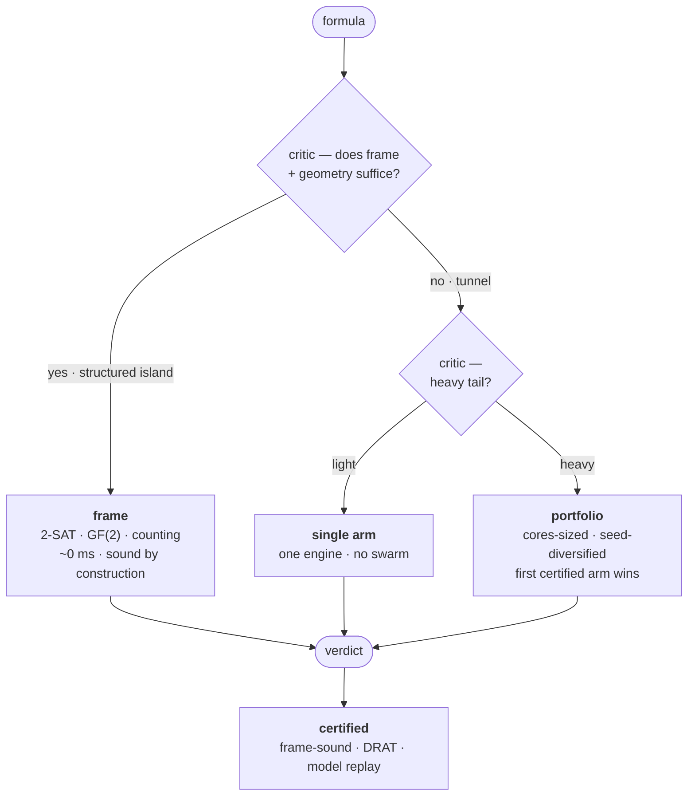
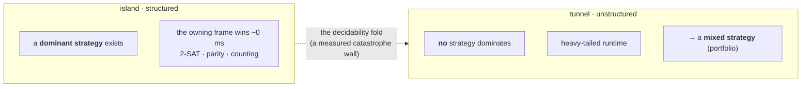
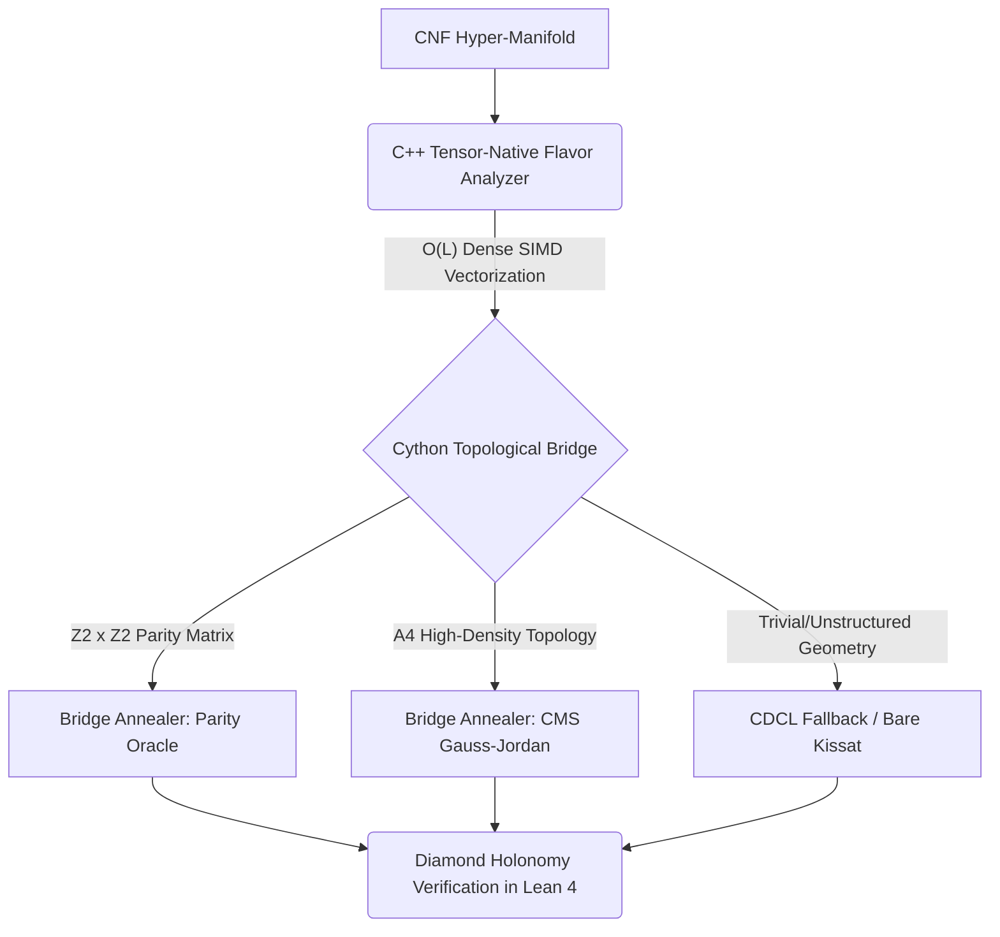

# λSAT · the moving frame


> *The path has chosen you, now you honour the springtime in the pathwalk.*
> **CANARY REPOSITORY:** This is the experimental, formalized structure of the solver.

> *A solver that carries its own proof, and knows which shape of hardness it's looking at.*

[](https://github.com/jesusvilela/lambda-sat-solver/actions/workflows/tests.yml)

Headless. No web UI. No *trust-me*.

A λ-logic middleware for Boolean satisfiability that **verifies every verdict it emits** —
SAT by model replay, UNSAT by an independent DRAT proof or a sound algebraic frame. On top
of the solver sits a research program on the *intrinsic shape of SAT hardness*: three sound
algebraic frames, a hyperbolic map of instance-space, and a game-theoretic dispatcher that
reads an instance before it searches.

Kissat is a tool here, not an authority. A wrong answer is **caught**, not believed.

---

## 何 · what it is

Two halves, one discipline.

**The solver** — a typed λ-DSL over sound frames and certified CDCL. Every result carries a
checkable certificate.

**The ladder** — an honest study of where hardness *lives*, each claim bound to a test.
The stance is written down in [`docs/CHARTER.md`](docs/CHARTER.md). *A name is not a proof.*
Read it first.

---

## 道 · the path

An instance is **described** before it is solved. The description — laws (conserved
invariants), relations (frame couplings), motions (its place on the hyperbolic fabric) —
tells the actor which move to play.



Structure is decided instantly and for free — the frame *is* the certificate. Only the
structureless tail reaches a solver, and even then the answer is re-checked.

---

## 三面 · three frames, one fold

Each obstruction has one sound, engine-independent frame. What escapes all three is not a
failure of the map — it is a different *region*, and the map says so.



The fold is not a metaphor — it is a Fisher–Rao metric singularity, measured in the natural
coordinate ([`docs/ladder/FABRIC_NOTE.md`](docs/ladder/FABRIC_NOTE.md)). It is also the line
where game theory flips: on the island a *pure* strategy dominates; on the tunnel you must
*mix*. Same boundary, two languages.

---

## 構造 · the Canary stack (Adiabatic Geodesic Flow)

The Canary architecture wholly abandons heuristic python string-matching and scalar Euclidean approximations (like simplistic `m/n` clause-ratio checks). Instead, it physicalizes the solver as a Hamiltonian system operating under hyper-dimensional Riemannian logic. Every layer is mapped directly to a structural C++ topology extractor, bridging discrete logic into a continuous Riemannian manifold.

> **Read the full philosophical and mathematical integration:** [The Ultimate Synthesis](ultimate_synthesis.md)



- **Flavor Analyzer** (`backend/cpp/flavor_analyzer.hpp`) — C++ structural extractor. Reads the exact hyper-dimensional geometry of the CNF to map dispersion groups ($Z_2 \times Z_2$, $A_4$, Trivial).
- **Cython Bridge** (`backend/cython/tribridge.pyx`) — Lifts the C++ `vector[vector[int]]` geometry into the Python space seamlessly.
- **BBD Router** (`backend/cpp/router.hpp`) — Breathing Bridge Descent. Selects the geodesic path instantly based on the Flavor group, acting as a Hamiltonian state transition rather than a heuristic choice. It rejects Euclidean scalars in favor of topological shape-matching (e.g., verifying exact variable overlap for XOR expansion).
- **Parity Oracle** — Handles highly structured cryptographic chains with zero search.
- **CDCL Fallback** (`Kissat/CaDiCaL`) — The unstructured heavy-tail engine.
- **Diamond Holonomy Benchmarking** — Evaluates paths using rigorous TFLOPS-bounded physics instead of scalar time.

> Every number here is a *measured* claim on a small, fixed, synthetic mix — regenerate it
> with one command and read the scope in [`REPRODUCIBILITY.md`](REPRODUCIBILITY.md). This is
> a certified middleware and a research harness, **not** a claim of a generally faster SAT
> solver.
For exact measured/proven/speculative status, read [`PUBLIC_RESEARCH_CLAIMS.md`](PUBLIC_RESEARCH_CLAIMS.md)
and [`REPRODUCIBILITY.md`](REPRODUCIBILITY.md) before citing benchmark numbers.

---

## 証 · certification — the TCB

**Kissat is not in the trusted base.** The trusted core is small and independent:

1. DIMACS parser · Tseitin transform
2. model checker — replays SAT assignments against the original formula
3. DRAT checker (`drat-trim`) — replays UNSAT proofs with an independent tool

The three frames are **sound by construction** — no external checker, the derivation *is*
the proof. Only the CDCL fallback's UNSAT certificate needs `drat-trim`. Full
proven / measured / speculative ledger in
[`PUBLIC_RESEARCH_CLAIMS.md`](PUBLIC_RESEARCH_CLAIMS.md).

---

## 始 · quick start

```bash
python -m pip install --upgrade pip
pip install -e .[dev]
# install Kissat + drat-trim for strict external certification; see BACKEND_README.md

python -m backend.cli examples/simple_sat.cnf --heuristic aggressive
python -m pytest backend/tests/ -q
```

### Benchmarking against SAT Competition
To operationalize the solver and squeeze performance on standard competition instances (`.cnf`, `.xz`, `.lzma`):

```bash
python -m backend.benchmark_cli ./cache/zenodo_full/ --pattern "*.xz" --timeout 5000 --parallel
```

Strict certification smoke tests:

```bash
python -m backend.cli examples/simple_sat.cnf --mode strict
python -m backend.cli examples/simple_unsat.cnf --mode strict
```

CLI install path:

```bash
lambda-sat examples/simple_sat.cnf --mode strict
```

```python
from backend.acaf import acaf_solve            # the adaptive game-player
r = acaf_solve(formula)                         # frame · single · or portfolio
assert r.certified                              # every verdict carries its proof
```

---

## structure

```
backend/
  frame_solver.py      three sound frames + coupling (the router)
  metasolver.py        description-driven dispatch  (beats CMS on the mix)
  metametasolver.py    fractal portfolio           (out-searches CMS on the tail, parallel)
  metasolver.py        description-driven dispatch  (scoped benchmark mix)
  metametasolver.py    fractal portfolio           (scoped heavy-tail benchmark)
  acaf.py              adaptive actor-critic policy (cores-sized mixed strategy)
  dynamics.py          laws · relations · motions   (the view from outside)
  fabric.py            the instance as a woven tapestry
  fabric_model.py      the family distributions, hyperbolic (Poincaré ball)
  observer.py          the adjudicator — certify, don't trust
  lambda_sat.py        λ ⊗ SAT fusion (β-reduce → CNF + remainder → decide)
  {binary_clause,xor_extraction,cardinality}_check.py   the three frames
  complexity/          intrinsic hardness invariants + contracts
  tests/               the full suite
docs/
  CHARTER.md           stance & claim discipline (read first)
  ladder/              the research index, notes, and benchmarks
```

Research index: [`docs/ladder/README.md`](docs/ladder/README.md).
Per-invariant promises: [`docs/ladder/CONTRACTS.md`](docs/ladder/CONTRACTS.md).
Reproduction guide: [`REPRODUCIBILITY.md`](REPRODUCIBILITY.md).

---

## references

- **Kissat** · **CaDiCaL** — Armin Biere · **CryptoMiniSat** — Mate Soos
- **DRAT / LRAT** — certified UNSAT proof formats
- **Gomes–Selman** — heavy-tailed runtime & portfolios · **von Neumann** — the minimax theorem
- **Ben-Sasson–Wigderson** (width ↔ size) · **Clegg–Edmonds–Impagliazzo** (polynomial calculus) — the ladder's anchors

## license

See [`LICENSE`](LICENSE).